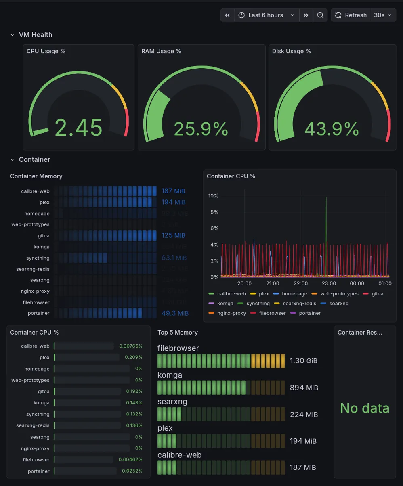

# Home Lab Monitoring Stack

A lightweight monitoring stack for a home server, providing operational visibility of host infrastructure and Docker containers via Prometheus and Grafana.

## Dashboard



## Architecture
```
Host
└── Linux VM (Docker)
    ├── Prometheus (:9090)      ← scrapes all exporters
    ├── Grafana (:3002)         ← queries Prometheus
    ├── node_exporter (:9100)   ← host CPU/RAM/Disk
    ├── Telegraf (:9273)        ← container metrics via Docker API
    └── [your other containers]
```

All services accessible via Tailscale mesh VPN. No public ports exposed.

## Tech Stack

| Component | Version | Purpose |
|---|---|---|
| Prometheus | v3.8.0 | Metrics collection & storage (14-day retention) |
| Grafana | 12.3.0 | Dashboard visualisation |
| node_exporter | v1.10.2 | Host-level CPU, RAM, Disk, Network metrics |
| Telegraf | 1.33 | Container metrics via Docker socket API |
| Docker Compose | v2 | Service orchestration |

### Why Telegraf instead of cAdvisor?

cAdvisor can fail to discover Docker containers when using a non-standard Docker data root combined with cgroup v2. Telegraf with its Docker input plugin reads directly from the Docker socket API and works regardless of the storage driver path.

## Quick Start

### Prerequisites
- Docker and Docker Compose installed
- An external Docker network named `monitoring`
- Tailscale (optional, for remote access)

### 1. Create the network
```bash
docker network create monitoring
```

### 2. Configure environment
```bash
cp .env.example .env
# Edit .env and set a strong GRAFANA_PASSWORD
```

### 3. Deploy the stack
```bash
docker compose up -d
```

### 4. Verify
```bash
# Prometheus healthy
curl http://localhost:9090/-/healthy

# Grafana healthy
curl -s http://localhost:3002/api/health

# node_exporter responding
curl -s http://localhost:9100/metrics | head -5

# Telegraf container metrics
curl -s http://localhost:9273/metrics | grep docker_container_mem_usage | head -3
```

### 5. Connect Grafana to Prometheus
1. Open Grafana at `http://<your-ip>:3002`
2. Log in with `admin` / your password
3. Connections → Data Sources → Add → Prometheus
4. URL: `http://prometheus:9090`
5. Save & Test

## Dashboard Panels

### VM Health Row
Three gauges showing host resource utilisation with traffic-light thresholds:

| Panel | Query | Thresholds |
|---|---|---|
| CPU Usage % | `100 - (avg by(instance_name)(rate(node_cpu_seconds_total{mode="idle"}[5m])) * 100)` | Green <70, Yellow 70-85, Red >85 |
| RAM Usage % | `(1 - node_memory_MemAvailable_bytes / node_memory_MemTotal_bytes) * 100` | Green <70, Yellow 70-85, Red >85 |
| Disk Usage % | `(1 - node_filesystem_avail_bytes{mountpoint="/"} / node_filesystem_size_bytes{mountpoint="/"}) * 100` | Green <70, Yellow 70-85, Red >85 |

### Container Row
Per-container metrics for all Docker services (monitoring stack filtered out):

| Panel | Type | Query |
|---|---|---|
| Container Memory | Bar gauge | `sort_desc(docker_container_mem_usage{container_name!~"prometheus\|grafana\|telegraf\|node-exporter"})` |
| Container CPU % | Time series | `docker_container_cpu_usage_percent{container_name!~"prometheus\|grafana\|telegraf\|node-exporter"}` |
| Top 5 Memory | Bar gauge | Top consumers by RAM |
| Container Restarts (24h) | Stat | `changes(docker_container_status{...container_status="running"}[24h]) > 0` |

The dashboard JSON is committed at `grafana/dashboards/home-lab-overview.json`.

## Customisation

- **Telegraf GID:** The `user` field in `docker-compose.yml` uses a hardcoded Docker group ID. Find yours with `getent group docker` and update accordingly.
- **Grafana port:** Defaults to 3002 — change the host port mapping in `docker-compose.yml` if needed.
- **Prometheus retention:** Defaults to 14 days. Adjust `--storage.tsdb.retention.time` in `docker-compose.yml`.

## Repository Structure
```
homelab-monitoring/
├── README.md
├── preview.webp
├── .env.example
├── .gitignore
├── docker-compose.yml
├── prometheus/
│   └── prometheus.yml
├── telegraf/
│   └── telegraf.conf
└── grafana/
    └── dashboards/
        └── home-lab-overview.json
```

## Port Allocation

| Service | Port | Access |
|---|---|---|
| Prometheus | 9090 | Tailscale only |
| Grafana | 3002 | Tailscale only |
| node_exporter | 9100 | Tailscale only |
| Telegraf | 9273 | Tailscale only |

## Teardown
```bash
docker compose down
docker volume rm monitoring_prometheus_data monitoring_grafana_data
docker network rm monitoring
```

## License

MIT
